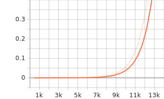

# CS5260 Assignment 6
## Colossalai and LR Range Test

Student ID: A0225575Y

Date: 1 April 2022

Github Repository : https://github.com/azmimr/cs5260_assignment6

## Overivew

The objective of this assignment is to conduct a learning rate range test using various scheduling methods to identify reasonable values. This will help in reducing the time needed to finetune a deep learning model.

The method used for experimentation is proposed by Leslie N. Smith in
paper Super-Convergence: Very Fast Training of Neural Networks Using
Large Learning Rates. The idea is: before normally training your model
to convergence, first train your model with exponentially increasing
learning rate (increase with batch step) for several epochs, and observe
the loss curve. Usually the loss will first keep unchanged, and then go
down, and finally explode. The learning rate corresponding to loss going
down will be usable LR, and explosion part is not usable.

In this set of experiments, the selected optimizer is Stochastic Gradient Descent (SGD). The following learning rate schedulers are used from pytorch are used:
- StepLR
- OneCycleLR
- ExponetialLR
- No scheduler

For each of these experiments, the loss curves will be shown.

## Experiment 1: StepLR

Decays the learning rate of each parameter group by gamma every step_size epochs. 

Tensorboard by default plots the LR scheduler function as a piecewise plot. However, since the function used is a step function, this is not the correct visualization. For this function, we replace the plot using matplotlib.

<figure>

<figcaption align = "center"><b>Learning rate curve for StepLR</b></figcaption>
</figure>

<figure>

<figcaption align = "center"><b>Loss curve for train dataset</b></figcaption>
</figure>

<figure>

<figcaption align = "center"><b>Loss curve for test dataset</b></figcaption>
</figure>

The step function scheduler looks like a piece-wise exponential function. Once set, all the batches in a epoch will use the same value. The general loss curves looks very similar to that for the exponential scheduler.

## Experiment 2: OneCycleLR

Sets the learning rate of each parameter group according to the 1cycle learning rate policy. The 1cycle policy anneals the learning rate from an initial learning rate to some maximum learning rate and then from that maximum learning rate to some minimum learning rate much lower than the initial learning rate.

<figure>

<figcaption align = "center"><b>Learning rate curve for StepLR</b></figcaption>
</figure>

<figure>

<figcaption align = "center"><b>Loss curve for train dataset</b></figcaption>
</figure>

<figure>

<figcaption align = "center"><b>Loss curve for test dataset</b></figcaption>
</figure>

When the learning rate value increases to a large number in the middle epochs, the losses will increase to a high value, essentially we are moving away from minimum in the loss function. Once the learning rate begins to reduce again in the later epochs, we see the loss reduce as expected. One posible advantage of this scheduler is that it allows the optimizer to 'jump out' of a local minima, if it was badly initialized and then attempt to find the global minima for the loss. 

## ExponentialLR

Decays the learning rate of each parameter group by gamma every epoch.

<figure>

<figcaption align = "center"><b>Learning rate curve for StepLR</b></figcaption>
</figure>

<figure>

<figcaption align = "center"><b>Loss curve for train dataset</b></figcaption>
</figure>

<figure>

<figcaption align = "center"><b>Loss curve for test dataset</b></figcaption>
</figure>

This scheduler is very similar to that of the step scheduler with the main difference being that the learning rate increment is done at each batch. The resulting curves are very similar and should show some agreement between them.

## No scheduler

In this experiment, we use a single fixed learning rate throughout training. The values is set to the default initial value used in all the other experiments.

<figure>

<figcaption align = "center"><b>Loss curve for train dataset</b></figcaption>
</figure>

<figure>

<figcaption align = "center"><b>Loss curve for test dataset</b></figcaption>
</figure>

As expected, since the learning rate is fixed, we expect the loss function to reduce if the value is reasonable. In this experiment, we can see that there is no convergence in the training as the learning value is too small which requires additional many epochs for training.

Using this method will require many iterations of testing to identify a suitable value for training the model.

## Results and Conclusion

From the experiments, experiment 2 using the Cyclic scheduler would suggest that very large values for the learning rate can be used at least during the initial epochs. However, this is not true. Large learning can be used only when the losses are large indicating that the optimizer is far away from the loss function minimum.

A more reasonable range is suggested by the Exponential and Step scheduler. Learning rate values between **0.05** and **5e-4** seems to be a good balance. The larger value could be used in the initial epochs which then reducs to the lower value as the training continues.